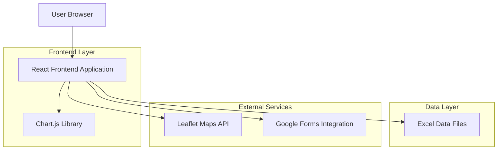
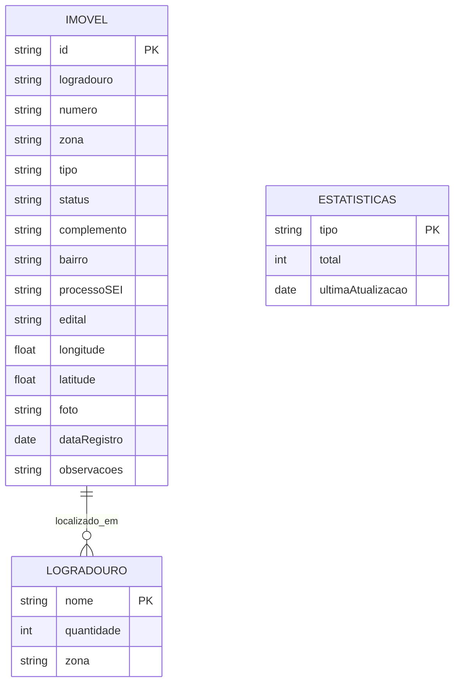

# Arquitetura Técnica - Dashboard de Imóveis Abandonados

## 1. Architecture design



## 2. Technology Description

- Frontend: React@18 + TypeScript@5 + Tailwind CSS@3 + Vite@5
- Maps: Leaflet@1.9 + React-Leaflet@4
- Charts: Chart.js@4 + React-Chartjs-2@5
- Data: SheetJS@0.20 (para leitura de Excel)
- UI Components: Headless UI@1.7 + Heroicons@2
- Backend: None (aplicação estática com dados em Excel)

## 3. Route definitions

| Route | Purpose |
|-------|---------|
| / | Dashboard principal com mapa, estatísticas e filtros |
| /imovel/:id | Página de detalhes de um imóvel específico |
| /relatorios | Página de relatórios e análises estatísticas |
| /admin | Área administrativa para gestão de dados (protegida) |
| /admin/login | Página de login para administradores |

## 4. API definitions

### 4.1 Core Data Types

```typescript
interface Imovel {
  id: string;
  logradouro: string;
  numero: string;
  zona: 'Norte' | 'Sul' | 'Leste' | 'Oeste';
  tipo: 'Casa' | 'Construção' | 'Prédio' | 'Terreno';
  status: 'Abandonado' | 'Em análise' | 'Regularizado';
  complemento?: string;
  bairro: string;
  processoSEI: string;
  edital?: string;
  longitude: number;
  latitude: number;
  foto?: string;
  dataRegistro: string;
  observacoes?: string;
}

interface FiltrosDashboard {
  processoSEI?: string;
  edital?: string;
  endereco?: string;
  tipo?: string[];
  zona?: string[];
  status?: string[];
}

interface EstatisticasGerais {
  totalImoveis: number;
  porTipo: Record<string, number>;
  porZona: Record<string, number>;
  porStatus: Record<string, number>;
  logradourosTop: Array<{
    nome: string;
    quantidade: number;
  }>;
}
```

### 4.2 Data Processing Functions

```typescript
// Função para carregar dados do Excel
function carregarDadosExcel(): Promise<Imovel[]>

// Função para aplicar filtros
function aplicarFiltros(imoveis: Imovel[], filtros: FiltrosDashboard): Imovel[]

// Função para calcular estatísticas
function calcularEstatisticas(imoveis: Imovel[]): EstatisticasGerais

// Função para exportar dados
function exportarDados(imoveis: Imovel[], formato: 'excel' | 'csv' | 'pdf'): void
```

## 5. Data model

### 5.1 Data model definition



### 5.2 Data Definition Language

Estrutura do arquivo Excel (imoveis-abandonados.xlsx):

```excel
Planilha: "Imoveis"
Colunas:
- A: ID (string) - Identificador único
- B: Logradouro (string) - Nome da rua/avenida
- C: Numero (string) - Número do imóvel
- D: Zona (string) - Norte/Sul/Leste/Oeste
- E: Tipo (string) - Casa/Construção/Prédio/Terreno
- F: Status (string) - Abandonado/Em análise/Regularizado
- G: Complemento (string) - Informações adicionais
- H: Bairro (string) - Nome do bairro
- I: ProcessoSEI (string) - Número do processo
- J: Edital (string) - Número do edital
- K: Longitude (number) - Coordenada GPS
- L: Latitude (number) - Coordenada GPS
- M: Foto (string) - URL ou caminho da foto
- N: DataRegistro (date) - Data de cadastro
- O: Observacoes (string) - Observações gerais
```

Dados de exemplo baseados na imagem fornecida:

```csv
ID,Logradouro,Numero,Zona,Tipo,Status,Complemento,Bairro,ProcessoSEI,Edital,Longitude,Latitude,Foto,DataRegistro,Observacoes
001,Rua Desembargador Freitas,1510,Norte,Terreno,Abandonado,,Centro,00037.005582/2024-31,,-42.8019162,-5.08373000,foto001.jpg,2024-01-15,
002,Rua Rachuelo,,Norte,Casa,Abandonado,Ao lado do nº 30,Centro,00027.005582/2024-17,,-42.8052643,-5.05937876,foto002.jpg,2024-01-16,
003,Rua Lisandro Nogueira,1630,Norte,Terreno,Abandonado,,Centro,00027.005582/2024-54,,-42.8112586,-5.06293510,foto003.jpg,2024-01-17,
004,Rua Eliseu Martins,1542,Norte,Casa,Abandonado,,Centro,00027.005582/2024-44,,-42.8123502,-5.06216003,foto004.jpg,2024-01-18,
005,Rua Barroso,,Norte,Prédio,Abandonado,,Centro,00027.005582/2024-23,,-42.8116548,-5.05842638,foto005.jpg,2024-01-19,
```