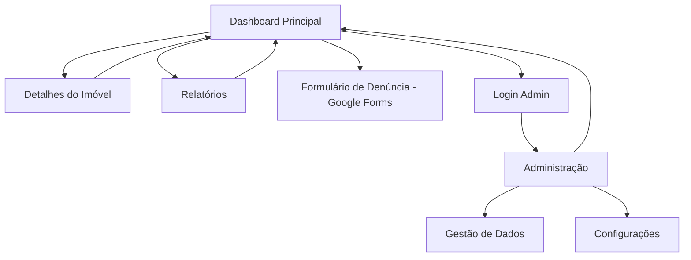

# Dashboard de Imóveis Abandonados - Centro de Teresina

## 1. Product Overview

Sistema web interativo para monitoramento e gestão de imóveis abandonados no centro de Teresina, baseado em dados do processo SEI da Secretaria de Desenvolvimento Urbano e Habitação do Piauí.

O dashboard permite visualização geográfica dos imóveis, análise estatística dos dados, filtragem por critérios específicos e facilita denúncias através de integração com formulário online, auxiliando na revitalização urbana do centro histórico.

## 2. Core Features

### 2.1 User Roles

| Role | Registration Method | Core Permissions |
|------|---------------------|------------------|
| Usuário Público | Acesso direto (sem registro) | Visualizar dados, usar filtros, fazer denúncias |
| Administrador | Login com credenciais | Gerenciar dados, atualizar informações, gerar relatórios |

### 2.2 Feature Module

Nosso dashboard de imóveis abandonados consiste nas seguintes páginas principais:

1. **Dashboard Principal**: mapa interativo, estatísticas gerais, filtros de busca, botão de denúncia
2. **Detalhes do Imóvel**: informações completas, fotos, histórico, localização específica
3. **Relatórios**: análises estatísticas, gráficos, exportação de dados
4. **Administração**: gerenciamento de dados, upload de arquivos, configurações (apenas admin)

### 2.3 Page Details

| Page Name | Module Name | Feature description |
|-----------|-------------|---------------------|
| Dashboard Principal | Mapa Interativo | Exibir mapa do centro de Teresina com marcadores dos 217 imóveis abandonados, zoom, navegação |
| Dashboard Principal | Painel de Estatísticas | Mostrar total de imóveis (217), contadores por tipo (Casa, Construção, Prédio, Terreno) |
| Dashboard Principal | Filtros de Busca | Filtrar por Processo SEI, Edital, Endereço com dropdowns "Todos" |
| Dashboard Principal | Lista de Logradouros | Exibir ranking de ruas com maior número de imóveis (Rua Barroso: 13, Rua 7 de Setembro: 11, etc.) |
| Dashboard Principal | Botão de Denúncia | Redirecionar para formulário Google Forms para denúncias de novos imóveis |
| Dashboard Principal | Tabela de Dados | Listar todos os imóveis com colunas: Logradouro, Número, Zona, Tipo, Status, Complemento, Bairro, Processo, Edital, Longitude, Latitude |
| Detalhes do Imóvel | Informações Completas | Exibir todos os dados do imóvel selecionado, coordenadas GPS, status atual |
| Detalhes do Imóvel | Galeria de Fotos | Mostrar foto do local atual, histórico de imagens se disponível |
| Detalhes do Imóvel | Mapa Individual | Mapa focado no imóvel específico com marcador destacado |
| Relatórios | Gráficos Estatísticos | Gráficos de distribuição por tipo, zona, status, evolução temporal |
| Relatórios | Exportação | Exportar dados em Excel, PDF, CSV |
| Administração | Gestão de Dados | Upload de planilhas, edição de registros, validação de dados |
| Administração | Configurações | Gerenciar usuários, configurar integrações, backup de dados |

## 3. Core Process

**Fluxo do Usuário Público:**
O usuário acessa o dashboard principal, visualiza o mapa com os imóveis abandonados, utiliza filtros para refinar a busca, clica em marcadores para ver detalhes, consulta a lista de logradouros, e pode fazer denúncias através do botão vermelho que redireciona para o formulário Google Forms.

**Fluxo do Administrador:**
O administrador faz login, acessa todas as funcionalidades do usuário público, além de poder gerenciar dados através da área administrativa, fazer upload de novas planilhas, editar informações dos imóveis e gerar relatórios detalhados.

## 4. User Interface Design

### 4.1 Design Style

- **Cores Primárias**: Azul (#2E86AB) para marcadores e elementos principais, Branco (#FFFFFF) para fundos
- **Cores Secundárias**: Vermelho (#DC3545) para botão de denúncia, Cinza (#6C757D) para textos secundários
- **Estilo de Botões**: Botões arredondados com sombra sutil, botão de denúncia em destaque vermelho
- **Fonte**: Roboto ou similar, tamanhos 14px para texto normal, 16px para títulos, 12px para legendas
- **Layout**: Design limpo estilo card-based, navegação superior, sidebar para filtros
- **Ícones**: Ícones Material Design ou Font Awesome, marcadores de mapa personalizados

### 4.2 Page Design Overview

| Page Name | Module Name | UI Elements |
|-----------|-------------|-------------|
| Dashboard Principal | Mapa Interativo | Mapa ocupando 60% da tela, marcadores azuis circulares, controles de zoom, botão de localização |
| Dashboard Principal | Painel de Estatísticas | Cards brancos com bordas sutis, números grandes em destaque, ícones representativos |
| Dashboard Principal | Filtros | Dropdowns estilizados, botão "Limpar Filtros", layout horizontal compacto |
| Dashboard Principal | Lista de Logradouros | Card lateral direito, lista com números de ocorrências, scroll vertical |
| Dashboard Principal | Botão de Denúncia | Botão vermelho fixo no canto inferior direito, ícone de alerta, texto "DENUNCIAR IMÓVEL ABANDONADO" |
| Dashboard Principal | Tabela de Dados | Tabela responsiva com paginação, ordenação por colunas, busca rápida |
| Detalhes do Imóvel | Modal/Página | Modal overlay ou página dedicada, layout em duas colunas (info + mapa) |
| Relatórios | Gráficos | Charts coloridos, legendas claras, filtros de período, botões de exportação |

### 4.3 Responsiveness

O dashboard é desenvolvido com abordagem mobile-first, adaptando-se automaticamente para tablets e desktops. Em dispositivos móveis, o mapa ocupa a tela inteira com controles touch otimizados, filtros colapsáveis e tabela com scroll horizontal. A navegação é simplificada com menu hambúrguer e botões de ação maiores para facilitar o toque.